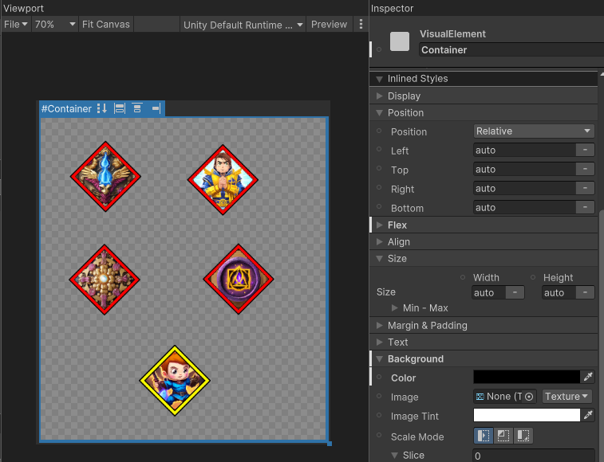

# Day 3: Manually Building a UI
{: .no_toc }

Today, we manually built a visual representation of a Skill Tree 
using Unity's UI Toolkit. Additionally, we explored the Vector Graphics
API to automatically connect nodes in the Skill Tree together.

* [Watch On YouTube](https://youtube.com/live/ow5piavuQaI)
* [Source Code at the End of Day 3](https://github.com/CaptainCoderOrg/SkillTree/tree/end-of-day-3)


<details open markdown="block">
  <summary>
    Table of contents
  </summary>
  {: .text-delta }
1. TOC
{:toc}
</details>

## Today's Tasks

1. <s>Create a rough draft / manual Skill Tree</s>
2. Extract components from draft
3. Start implementing a ISkillTree to UI transformer

## Skill Node Graphics

To better understand the components necessary to dynamically generate a Skill
Tree UI, we first implemented one manually. To start, we used Leonardo.AI to
generate assets for the skill tree we used for testing on Day 2.

Below are the node graphics that resulted:


## Skill Tree UI

Using the generated nodes, we were able to place them into a UXML document using
the UI Builder:



## Adding Lines

Unfortunately, the UI Builder does not provide a build in way to easily draw
lines between components. Fortunately, there does exist an API for
programmatically rendering Vectors within the UI Builder. With this in mind,
we wrote a very simple `LineElement` class which draws a line between two
elements within a UXML Document:

 ```csharp
public class LineElement : VisualElement
{

    public LineElement()
    {
        // The generateVisualContent delegate is called when this element
        // is drawn to the screen. We're not sure what the life cycle of this
        // delegate is. How often is it called? When is it called?
        generateVisualContent += OnGenerateVisualContent;
    }

    // Specifies the identifier of the start and end elements 
    // which will have a line between them.
    public void Init(string startElement, string endElement)
    {
        StartElement = startElement;
        EndElement = endElement;
    }

    public string StartElement { get; set; }
    public string EndElement { get; set; }

    // Draws a line between the start and end element
    private void OnGenerateVisualContent(MeshGenerationContext mgc)
    {
        VisualElement start = parent.Q<VisualElement>(StartElement);
        VisualElement end = parent.Q<VisualElement>(EndElement);
        Vector2 startVector = start.layout.center;
        Vector2 endVector = end.layout.center;
        var paint2D = mgc.painter2D;
        paint2D.strokeColor = Color.red;
        paint2D.lineWidth = 5;
        paint2D.BeginPath();
        paint2D.MoveTo(startVector);
        paint2D.LineTo(endVector);
        paint2D.ClosePath();
        paint2D.Stroke();
    }

    // These classes are necessary to access the LineElement in the UI Builder
    public sealed new class UxmlFactory : UxmlFactory<LineElement, UxmlTraits> { }

    // Adds the option to specify the start and end element in the UI Builder
    public sealed new class UxmlTraits : VisualElement.UxmlTraits
    {
        UxmlStringAttributeDescription _startElement = new() { name = "start-element", defaultValue = string.Empty };
        UxmlStringAttributeDescription _endElement = new() { name = "end-element", defaultValue = string.Empty };

        public override void Init(VisualElement ve, IUxmlAttributes bag, CreationContext cc)
        {
            base.Init(ve, bag, cc);
            var line = ve as LineElement;
            string AsString(UxmlStringAttributeDescription e) => e.GetValueFromBag(bag, cc);
            line.Init(AsString(_startElement), AsString(_endElement));
        }
    }
}
```

With this class available, we manually added and specified the start and end
elements within the UIBuilder:

<video autoplay loop muted style="max-width:700px">
  <source src="../imgs/add-line.webm" type="video/webm">
</video>

With this class in place, it becomes trivial to re-arrange the nodes in the UI:


<video autoplay loop muted style="max-width:700px">
  <source src="../imgs/reshape-tree.webm" type="video/webm">
</video>

Unfortunately, this is all we had time for today! With this in place, we hope we
will be able to dynamically generate a Skill Tree UI given an arbitrary
`ISkillTree`. Can we do it? We'll find out tomorrow!

