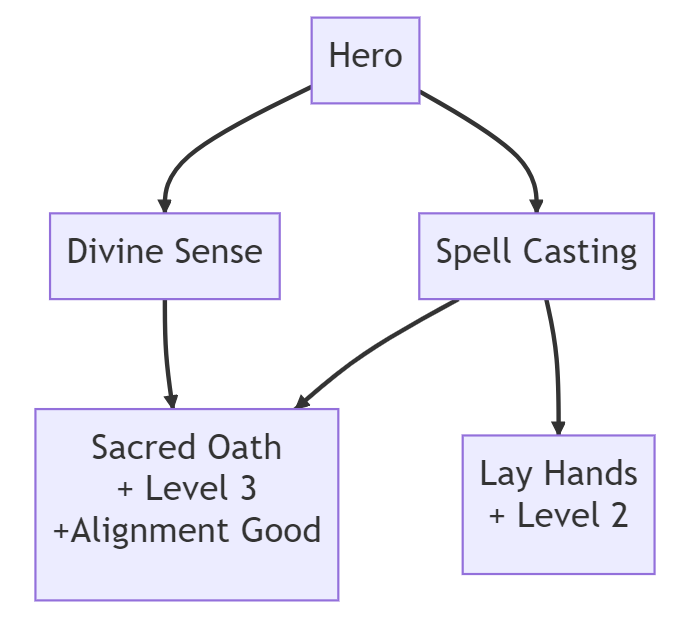

# Day 2: Skill Tree Builder and Unit Testing
{: .no_toc }

Today, we implemented a `SkillTreeBuilder` class that allows for construction of
an `ISkillTree`. While implementing this, we discovered a few flaws in our
interfaces which we corrected. Additionally, we wrote unit tests to validate
that the `SkillTreeBuilder` we implemented was correct.

* [Watch On YouTube](https://youtube.com/live/33_g4hJukIo)
* [Source Code at the End of Day 2](https://github.com/CaptainCoderOrg/SkillTree/tree/end-of-day-2)


<details open markdown="block">
  <summary>
    Table of contents
  </summary>
  {: .text-delta }
1. TOC
{:toc}
</details>

## Today's Tasks

1. <s>Implement Skill Tree Logic</s>
2. <s>Unit Test Skill Tree Logic</s>
3. Define ScriptableObjects to test SkillTree

## Redefining Skill Tree Interfaces

As we began to work with the interfaces we had previously defined, it became clear
that they would not meet our requirements. 

Our `ISkillTree<T>` interface, needed a lookup for specific nodes within the tree. To accommodate
this, we added a `GetNode` method:

```csharp
public interface ISkillTree<T> where T : ISkill
{
    /// The root node of this skill tree
    public ISkillNode<T> Root { get; }

    /// Retrieves the <see cref="ISkillNode{T}"/> associated with the specified
    /// <paramref name="skill"/>. Throws an exception if the specified <paramref
    /// name="skill"/> is not in this <see cref="ISkillTree{T}"/>.
    public ISkillNode<T> GetNode(T skill);
}
```

We also realized the `ISkilledEntity<T>` interface should utilize a `HashSet<T>` to represent the
skills the entity has acquired rather than the specific nodes:

```csharp
/// An <see cref="ISkilledEntity{T}"/> represents an entity that can acquire
/// skills of the specified type.
public interface ISkilledEntity<T> where T : ISkill
{
    /// A HashSet of skills that this entity has acquired
    public HashSet<T> Skills { get; }
}
```

Lastly, we extracted `ISkillRequirement` from within the `ISkillNode` making it a top level
interface:

```csharp
/// A Requirement acts as a predicate on a character.
public interface IRequirement<T> where T : ISkill
{
    /// Checks if the specified <paramref name="entity"/> meets this
    /// requirement.
    public bool MeetsRequirement(ISkilledEntity<T> entity);
}
```

## Implementing a SkillTreeBuilder

With these interfaces defined, we began to layout a `SkillTreeBuilder` API that would
allow us to construct a simple skill tree. Below is the public API that we defined:

```csharp
public class SkillTreeBuilder<T> where T : ISkill
{

    /// Instantiates an instance specifying the root node of the resulting <see cref="ISkillTree{T}"/>
    public SkillTreeBuilder(T root);

    /// Adds the specified <paramref name="parent"/> to <paramref name="child"/> requirement
    /// to the resulting <see cref="ISkillTree{T}"/>.
    public SkillTreeBuilder<T> AddSkill(T parent, T child);
    }

    /// Adds the specified <paramref name="requirement"/> to the <paramref name="skill"/>
    public SkillTreeBuilder<T> AddRequirement(T skill, IRequirement<T> requirement);

    /// Builds and returns a <see cref="ISkillTree{T}"/> as specified by this builder. Future
    /// modifications to the builder do not affect the returned tree.
    public ISkillTree<T> Build();
}
```

Using this set of methods, we can construct an `ISkillTree` in the following way:

```csharp
        SkillTreeBuilder<MySkillTree> builder = new(Hero);
        builder
            .AddSkill(Hero, SpellCasting)
            .AddSkill(Hero, DivineSense)
            .AddSkill(SpellCasting, LayOnHands)
            .AddRequirement(LayHands, new LevelRequirement(2))
            .AddSkill(DivineSense, SacredOath)
            .AddSkill(SpellCasting, SacredOath)
            .AddRequirement(SacredOath, new LevelRequirement(3))
            .AddRequirement(SacredOath, new AlignmentRequirement(Good));
        ISkillTree<MySkill> PaladinTree = builder.Build();
```



The implementation of the `SkillTreeBuilder` uses a dictionary to construct a
directed graph. Upon calling the `Build` method, a deep copy of that graph is
created and returned. The full implementation from today is available here:
[SkillTreeBuilder.cs](https://github.com/CaptainCoderOrg/CaptainCoder.Core/blob/1a7f329732ac0f4b56692ebd65a5e11ad175e489/CaptainCoder/SkillTree/SkillTreeBuilder.cs)

## Unit Tests

After defining the API that we would use, we developed a set of unit tests to
ensure that we could construct the skill tree described above. To help with
this, we utilized the [Moq] library which allows us to create a mocked
`ISkilledEntity` that we can validate the requirements against.

We first constructed the skill tree using the builder then, wrote a unit test for
each node in which we assert each of the specified properties. For example,
the `SimpleTreeTestSpellCastingNode` test is shown below:

```csharp
  [Fact]
  public void SimpleTreeTestSpellCastingNode()
  {
      // Get the SpellCasting node
      ISkillNode<MockSkill> skillNode = SimpleTree.GetNode(SpellCasting);

      // Check that the node retrieved has the SpellCasting skill
      Assert.Equal(SpellCasting, skillNode.Skill);

      // It should have two children
      Assert.Equal(2, skillNode.Children.Count());

      // The SacredOath and LayOnHands skills are in the children
      Assert.Contains(SimpleTree.GetNode(SacredOath), skillNode.Children);
      Assert.Contains(SimpleTree.GetNode(LayOnHands), skillNode.Children);
      
      // Setup a Mock ISkilledEntity
      Mock<ISkilledEntity<MockSkill>> mockEntity = new();
      // Specify that the entity has no skills
      mockEntity.Setup(x => x.Skills).Returns(new HashSet<MockSkill>());
      
      // If the entity has no skills, it should not pass the CheckRequirements
      Assert.False(skillNode.CheckRequirements(mockEntity.Object));

      // Specify that the entity should now have the Hero skill
      mockEntity.Setup(x => x.Skills).Returns(new HashSet<MockSkill> { Hero });

      // The entity should pass the CheckRequirements now
      Assert.True(skillNode.CheckRequirements(mockEntity.Object));
  }
```

A similar process was followed for each of the other nodes. You can find the
full set of tests from today here:
[SkillTreeBuilderTest](https://github.com/CaptainCoderOrg/CaptainCoder.Core/blob/1a7f329732ac0f4b56692ebd65a5e11ad175e489/Tests/CaptainCoder/SkillTree/SkillTreeBuilderTest.cs)

With this, we should be able to construct a variety of interesting skill trees
within a project. Unfortunately, we ran out of time and didn't make it to our
3rd goal **Define ScripatbleObjects to test SkillTree**. So, we have left that
for tomorrow. Will the library we came up with be enough for a skill tree
system? We'll find out soon enough! See you tomorrow!

