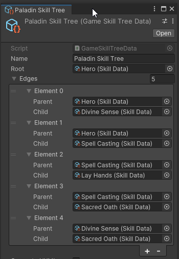

# Day 4: UI Generation: Version 0
{: .no_toc }

Today, we defined ScriptableObjects which can be used to specify a skill tree.
Then, we attempted to write a tool to automagically generate a UI based on a
skill tree. Unfortunately, we discovered that the desired behavior may not be
possible using a subclass of the `VisualElement` class. Off stream, the Captain
explored generating UXML which does have the intended behavior.

* [Watch On YouTube](https://youtube.com/live/dTeCOarDBMA)
* [Source Code at the End of Day 4](https://github.com/CaptainCoderOrg/SkillTree/tree/end-of-day-4)


<details open markdown="block">
  <summary>
    Table of contents
  </summary>
  {: .text-delta }
1. TOC
{:toc}
</details>

## Today's Tasks

1. <s>Create Scriptable Objects to represent Skill Tree Components</s>
2. Implement an ISkillTree to UI transformer

## Create Scriptable Objects

To make it easier to define skill trees in Unity's inspector, we implemented
a few ScriptableObjects.

### ScriptableSkillTree

The first object was a high level "interface" representing a ScriptableSkillTree:

```csharp
public class ScriptableSkillTree : ScriptableObject
{
    [field: SerializeField]
    public string Name { get; private set; }
    public virtual ISkillTree<ISkilledEntity<ISkill>, ISkill> SkillTree => throw new System.NotImplementedException("SkillTree property must be overridden in subclass");
}
```

Next we created a subclass of the `ScriptableSkillTree` which provides generic
types for specifying a more specific SkilledEntity and Skill type:

```csharp
public class SkillTreeData<E, S> : ScriptableSkillTree where E : ISkilledEntity<S> where S : ISkill, IHasRequirements<E, S>
{
    [field: SerializeField]
    public S Root { get; private set; }
    [field: SerializeField]
    public List<Edge> Edges { get; private set; }

    public override ISkillTree<ISkilledEntity<ISkill>, ISkill> SkillTree;
    public ISkillTree<E, S> BuildSkillTree();

    [System.Serializable]
    public class Edge
    {
        [field: SerializeField]
        public S Parent { get; private set; }
        [field: SerializeField]
        public S Child { get; private set; }
    }
}
```

This subclass provides the ability for the user to define the root of the tree
as well as the edges between nodes. Additionally, we provided an extra method
for building a skill tree of the specific type (rather than with the interface
types).

Ideally, these two trees would be the same tree under the hood. Unfortunately,
we couldn't quite wrap our heads around the type system. Eventually, I would like
to go back and understand why this isn't possible OR how we can change the types
to make it possible. This was one of our learning goals.

With the above generalized SkillTreeData, one need only extend the class and
provide the specific types to gain access to the serialized fields in the
inspector.

```csharp
[CreateAssetMenu(fileName = "Skill Tree", menuName = "Skills/Skill Tree")]
public class GameSkillTreeData : SkillTreeData<IPlayerCharacter, SkillData>
{
}
```

### IPlayerCharater and SkillData

With the above skill tree type defined, we also needed to provide an
`IPlayerCharacter`, an implementation of `ISkill`, and the specific requirements
that our derived game will allow:

```csharp
public class SkillData : ScriptableObject, ISkill, IHasRequirements<IPlayerCharacter, SkillData>
{
    [field: SerializeField]
    public string Name { get; private set; }
    [field: SerializeField]
    public string Description { get; private set; }
    [field: SerializeField]
    public Sprite Image { get; private set; }
    [field: SerializeField]
    public int RequiredLevel { get; private set; } = 1;
    [field: SerializeField]
    public int RequiredSkillPoints { get; private set; } = 1;
    [field: SerializeField]
    public List<SkillRequirementData> Requirements { get; private set; }
}
```

```csharp
public interface IPlayerCharacter : ISkilledEntity<SkillData>
{
    public int Level { get; }
    public int SkillPoints { get; }
    public Alignment Alignment { get; }
}
```

With this in place we were able to define a skill tree matching the one from our
Day 3 manual build:



## Attempting to Generate a UI

Next, we played around with how to generate a UI from the defined tree in a
generalized way. That is, how do you generate a base of a tree that can then be
modified. Additionally, can the generation code be generalized such that it does
not need to be re-implemented with every new project.

The first attempt was to implement a subclass of `VisualElement` that would
recursively generate the nodes of a skill tree. Unfortunately, when
`VisualElement`s are dynamically generated in this way, the resulting structure
cannot be modified in the UI Builder. This means, the layout of the resulting
skill tree cannot be updated by the user. This was a bit of a deal breaker and
we needed to come up with a new way.

## Off Stream

After the stream had ended, I spent time researching how to use UI Builder in
this way. Unfortunately, `VisualElement`s cannot be trivially serialized to
UXML. And, as far as I could find, there were no built tools for generating
UXML. There were many tools for parsing and loading UXML into VisualElements but
that was not the desired direction.

Finally, I decided I would need to implement my own UXML Generator. This resulted
in a very rough draft of a tool that could generate valid UXML. Note, this code
is quite rough and I intend to refactor it on Day 5:

```csharp
public class SkillTreeGenerator : IUXMLGenerator<ScriptableSkillTree>
{
    public static readonly string UI = "UnityEngine.UIElements";
    public static readonly string VisualElement = "ui:VisualElement";
    public static readonly string Background = "background-color: rgba(0, 0, 0, 0);";
    public static readonly string Position = "position: absolute;";
    
    private string ImageStyle(Sprite sprite) 
    {
        string width = $"width: {sprite.texture.width}px;";
        string height = $"height: {sprite.texture.height}px;";
        string path = AssetDatabase.GetAssetPath(sprite);
        AssetDatabase.TryGetGUIDAndLocalFileIdentifier(sprite, out string guid, out long localId);
        string image = $"background-image: url('project://database/{path}?fileID={localId}&guid={guid}&type=3#{sprite.name}');";
        return $"{width} {height} {image}";
    }
    public string ToUXMLElement(ScriptableSkillTree toConvert)
    {
        var namespaces = new XmlSerializerNamespaces();
        namespaces.Add("ui", UI);

        XmlDocument xml = new ();
        XmlElement el = xml.CreateElement("ui:UXML", UI);
        XmlElement container = xml.CreateElement(VisualElement, UI);
        container.SetAttribute("style", $"{Background} width:100%; height:100%; {Position}");
        container.SetAttribute("name", "Nodes");
        XmlElement edges = xml.CreateElement(VisualElement, UI);
        edges.SetAttribute("style", $"{Background} width:100%; height:100%; {Position}");
        edges.SetAttribute("name", "Edges");
        el.AppendChild(edges);
        el.AppendChild(container);
        
        
        foreach(var node in toConvert.SkillTree.Nodes)
        {
            XmlElement skillNode = xml.CreateElement(VisualElement, UI);
            skillNode.SetAttribute("style", $"{Background} {Position} {ImageStyle(node.Skill.Image)}");
            skillNode.SetAttribute("name", node.Skill.Name.Replace(" ", ""));
            container.AppendChild(skillNode);

            foreach (var child in node.Children)
            {
                XmlElement lineNode = xml.CreateElement("LineElement");
                lineNode.SetAttribute("name", $"{node.Skill.Name.Replace(" ", "")} -> {child.Skill.Name.Replace(" ", "")}");
                lineNode.SetAttribute("start-element", node.Skill.Name.Replace(" ", ""));
                lineNode.SetAttribute("end-element", child.Skill.Name.Replace(" ", ""));
                lineNode.SetAttribute("style", $"{Position} {Background}");
                edges.AppendChild(lineNode);
            }                
        }
        
        var settings = new XmlWriterSettings();
        settings.OmitXmlDeclaration = true;
        settings.Indent = true;
        XmlSerializer serializer = new (typeof(XmlElement));
        TextWriter writer = new StringWriter();
        
        serializer.Serialize(XmlWriter.Create(writer, settings), el, namespaces);
        return writer.ToString();
    }
}
```

The code above can accept a `ScriptableSkillTree` and generate a UXML file
that can be modified by the user. For example, the paladin skill tree generates
the following output:

```xml
<ui:UXML xmlns:ui="UnityEngine.UIElements" xmlns:uie="UnityEditor.UIElements" editor-extension-mode="False">
    <ui:VisualElement name="Edges" style="background-color: rgba(0, 0, 0, 0); width: 100%; height: 100%; position: absolute;">
        <LineElement name="Hero -&gt; DivineSense" start-element="Hero" end-element="DivineSense" style="position: absolute; background-color: rgba(0, 0, 0, 0);" />
        <LineElement name="Hero -&gt; SpellCasting" start-element="Hero" end-element="SpellCasting" style="position: absolute; background-color: rgba(0, 0, 0, 0);" />
        <LineElement name="DivineSense -&gt; SacredOath" start-element="DivineSense" end-element="SacredOath" style="position: absolute; background-color: rgba(0, 0, 0, 0);" />
        <LineElement name="SpellCasting -&gt; LayHands" start-element="SpellCasting" end-element="LayHands" style="position: absolute; background-color: rgba(0, 0, 0, 0);" />
        <LineElement name="SpellCasting -&gt; SacredOath" start-element="SpellCasting" end-element="SacredOath" style="position: absolute; background-color: rgba(0, 0, 0, 0);" />
    </ui:VisualElement>
    <ui:VisualElement name="Nodes" style="background-color: rgba(0, 0, 0, 0); width: 100%; height: 100%; position: absolute;">
        <ui:VisualElement name="Hero" style="background-color: rgba(0, 0, 0, 0); position: absolute; width: 128px; height: 128px; background-image: url(&apos;project://database/Assets/Sprites/hero-node.png?fileID=21300000&amp;guid=03e10783b8cbcce42af2a3ec24fd51c2&amp;type=3#hero-node&apos;); top: 317px; left: 107px;" />
        <ui:VisualElement name="DivineSense" style="background-color: rgba(0, 0, 0, 0); position: absolute; width: 128px; height: 128px; background-image: url(&apos;project://database/Assets/Sprites/divine-sense-node.png?fileID=21300000&amp;guid=5a9d619752c79724eb157cfd10f38225&amp;type=3#divine-sense-node&apos;); top: 209px; left: 5px;" />
        <ui:VisualElement name="SacredOath" style="background-color: rgba(0, 0, 0, 0); position: absolute; width: 128px; height: 128px; background-image: url(&apos;project://database/Assets/Sprites/sacred-oath-node.png?fileID=21300000&amp;guid=8e4085567988f3442ae02ad8782c3d66&amp;type=3#sacred-oath-node&apos;); top: 20px; left: -5px;" />
        <ui:VisualElement name="SpellCasting" style="background-color: rgba(0, 0, 0, 0); position: absolute; width: 128px; height: 128px; background-image: url(&apos;project://database/Assets/Sprites/spell-casting-node.png?fileID=21300000&amp;guid=62112b66ef156604f8edf72aa17e2abe&amp;type=3#spell-casting-node&apos;); top: 186px; left: 208px;" />
        <ui:VisualElement name="LayHands" style="background-color: rgba(0, 0, 0, 0); position: absolute; width: 128px; height: 128px; background-image: url(&apos;project://database/Assets/Sprites/layhands-node.png?fileID=21300000&amp;guid=442d875d3891cfa4c9ba9d681fc22570&amp;type=3#layhands-node&apos;); top: -10px; left: 208px;" />
    </ui:VisualElement>
</ui:UXML>
```

This UXML file can be opened and the layout can be adjusted in the UI Builder.

There is still a ton of work to do to finish the skill tree system and only 2
days remain! We may have to cut some features but we're going to see what we can
get done.

